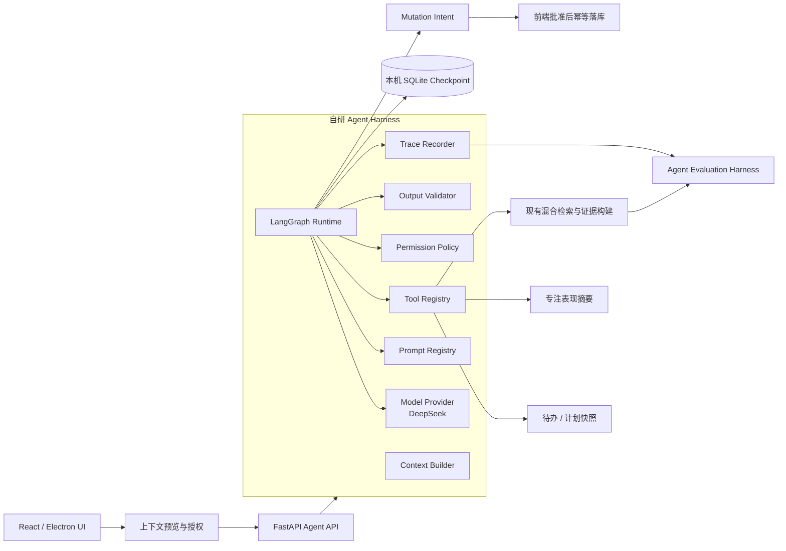
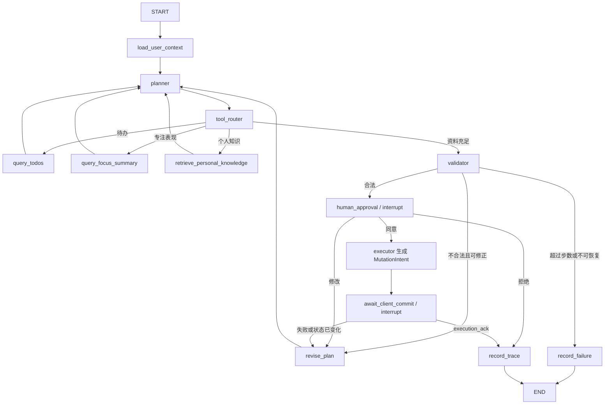

# 0.5 Agent Harness 与 LangGraph 融合设计

> 决策日期：2026-09-11
>
> 状态：0.5.0 已完成，下一步实施 0.5.1
> 目标：把现有可评测的引用式 RAG，演进为具备状态、工具、审批、恢复、轨迹和双层评测的个人行动 Agent。

## 1. 当前结论

项目在 0.5.0～0.5.2 主动加入 LangGraph 和自研轻量 Agent Harness，但不引入 CrewAI、AutoGen 等第二套编排框架。

- **LangGraph Runtime** 只负责状态图、条件路由、Checkpoint、Interrupt/Resume 和流式进度。
- **Agent Harness** 负责模型适配、Prompt 版本、工具注册、权限、预算、输出校验、Trace 和统一运行入口。
- **Evaluation Harness** 独立于线上运行流程，复用 Trace 批量评测检索、工具调用、轨迹、任务完成、安全、延迟和成本。
- **现有 RAG** 不推倒重写。混合检索、重排、上下文预算、引用和拒答继续作为底层能力；Agent 内部以只读的 `retrieve_personal_knowledge` 工具复用检索与证据构建，避免在 Planner 外再嵌套一次生成调用。

这四层职责不能混在一起。业务规则不能只写在 Prompt 里，权限检查不能交给模型判断，Evaluation Harness 也不能侵入线上业务路径。

## 2. 当前进度与缺口

| 层级 | 当前状态 | 证据或边界 | 下一验收门 |
| --- | --- | --- | --- |
| 行动产品 | 已有 | 待办便签、日计划、专注启动与复盘、训练记录 | 建立 Agent 可读取的最小快照契约 |
| 个人知识库 | 已有 | 浏览器 IndexedDB、来源授权、切块、哈希与清理 | 通过工具适配器接入 Agent |
| Retrieval Evaluation Harness | 已有 | 100 条人工查询、开发/保留集、BM25/BGE/RRF/Cross-Encoder 指标 | 保持为 Agent 评测的检索子指标 |
| 引用式 RAG | 0.4.4 已冻结 | DeepSeek 四类 12 条真实评测全部通过 | 作为 Agent 的只读知识检索工具接入 |
| Agent 上下文契约 | 0.5.0 已完成 | 可预览、可选择、带修订号和样本边界；敏感类别默认排除 | 0.5.1 增加批准后的状态冲突检查 |
| LangGraph Runtime | 0.5.0 已完成只读骨架 | Python 3.11、固定依赖、内存 Checkpointer、条件路由和节点流式更新 | 0.5.1 增加 SQLite、Interrupt/Resume 和重启恢复 |
| Agent Harness | 0.5.0 已完成骨架 | Provider、Prompt/Tool Registry、权限、输出校验和脱敏 Trace 已接通 | 0.5.2 完成预算、评测和统一接口 |
| Agent Evaluation Harness | 未开始 | 尚无工具轨迹、审批、恢复与副作用评测 | 0.5.2 建独立数据集、Runner 与报告 |

因此，项目已经通过 **0.5.0 的 Agent Foundation 验收**：可以基于真实前端快照运行只读状态图并生成经服务端校验的计划草案。现在仍不能宣称具备持久恢复、人工审批、业务写入或 Agent 轨迹评测，这些分别属于 0.5.1 和 0.5.2。

## 3. 目标架构



### 3.1 数据所有权边界

当前待办、计划和专注数据保存在浏览器 `localStorage`，知识库正文与块保存在浏览器 `IndexedDB`；Python 后端不能也不应绕过浏览器直接读写这些数据。

采用以下边界：

1. 前端从本地状态构造 `ActionContextSnapshot`，默认只包含完成任务所需的最小字段。
2. 用户在发送前可以预览、取消选择知识来源和敏感内容。
3. 后端只把快照当作本次运行的只读输入；知识检索只访问用户明确同步、授权的语料。
4. 模型不能直接写 `localStorage` 或 `IndexedDB`。所有变更先成为结构化 `MutationIntent`。
5. 人工批准后，前端校验 `action_id`、`base_state_revision` 和参数，再通过已有存储函数事务性应用。
6. 前端把 `execution_ack` 回传给图，Trace 只在收到确认后记录“已执行”。

这样既保留本地优先与隐私边界，也能真实展示 Human-in-the-loop 和 Durable Execution。

## 4. LangGraph 状态流



实现约束：

- `planner` 只生成结构化计划和工具需求，不拥有工具执行权限。
- `tool_router` 只能从注册表白名单选择工具；参数在执行前由 Pydantic Schema 和 Permission Policy 双重验证。
- 查询工具全部只读；任何写入必须经过 `human_approval`。
- `validator` 检查结构、引用、时间冲突、任务存在性、权限和预算，而不是只判断 JSON 能否解析。
- Planner/修订循环必须有最大步数、超时和可解释的失败状态。
- `interrupt()` 恢复时会从节点开头重新执行，因此中断前不得进行非幂等副作用；提交动作必须使用稳定 `action_id` 去重。

## 5. 核心契约

### 5.1 ActionContextSnapshot

建议字段：

```text
schema_version
snapshot_id
created_at
timezone
base_state_revision
user_request
goal_and_preferences
active_action_slips[]
recent_daily_plans[]
focus_summary
selected_knowledge_source_ids[]
consent_scope[]
sample_boundaries
```

快照保存的是完成任务所需的数据，不默认发送全部历史。`base_state_revision` 用于发现“生成后、本地状态已改变”的过期写入。

### 5.2 AgentState

建议字段：

```text
schema_version / graph_version
thread_id / run_id
request
context_snapshot
tool_requests[] / tool_results[]
evidence[]
plan_draft
validation_errors[]
approval_decision
mutation_intents[]
execution_ack
step_count / token_usage / estimated_cost
status / failure
```

Checkpoint 只保存可 JSON 序列化、恢复所需且经过最小化的数据。API Key、完整环境变量和不必要的原始个人正文不得进入 State、Trace 或错误日志。

### 5.3 ToolDefinition

每个工具必须声明：

```text
name
description
input_schema / output_schema
risk_level: read | propose_write | commit
required_permissions[]
timeout_ms
retry_policy
idempotent
redaction_policy
```

第一批工具：

| 工具 | 类型 | 数据来源 | 0.5.x 权限 |
| --- | --- | --- | --- |
| `query_todos` | 只读 | `ActionContextSnapshot` | 自动允许 |
| `query_focus_summary` | 只读 | 快照中的确定性聚合结果 | 自动允许 |
| `retrieve_personal_knowledge` | 只读 | 已授权并同步的本地检索索引 | 按来源授权 |
| `propose_weekly_plan` | 只提案 | Planner 结构化输出 | 自动允许，必须校验 |
| `save_plan` | 写入意图 | 前端计划存储 | 每次人工批准 |
| `start_focus` | 写入意图 | 前端专注流程 | 每次人工批准 |

`retrieve_personal_knowledge` 复用当前 `hybrid_search`、Cross-Encoder、拒答门控和证据预算，返回证据而不是再生成一份答案，从而避免嵌套模型调用、重复引用和双倍成本。

### 5.4 AgentHarness

目标接口保留用户提出的五个核心入口，并补充流式事件：

```python
class AgentHarness:
    def run(self, request, thread_id): ...
    def resume(self, thread_id, decision): ...
    def stream(self, thread_id): ...
    def register_tool(self, tool): ...
    def get_trace(self, run_id): ...
    def evaluate(self, dataset): ...
```

建议目录：

```text
server/agent/
├── contracts.py
├── harness.py
├── graph.py
├── nodes.py
├── tools.py
├── policies.py
├── prompts.py
├── checkpoints.py
└── tracing.py

server/evals/agent/
├── dataset.json
├── metrics.py
├── fakes.py
├── run.py
└── reports/
```

前端对应新增 `agentContext.ts`、`agentClient.ts`、`agentMutations.ts` 和计划审核界面。

## 6. 持久化、记忆、Trace 与版本策略

### Checkpoint

- 0.5.0 单元测试使用内存 Checkpointer。
- 0.5.1 本地运行使用独立安装的 `langgraph-checkpoint-sqlite`。
- SQLite 放在应用数据目录，不提交到 Git，也不混入 Qdrant 索引目录。
- 每次运行必须携带稳定 `thread_id`，并验证服务重启后可以继续批准或拒绝。

### Memory

- 0.5.x 只实现 thread-scoped 短期状态。
- 跨会话偏好只读取用户显式保存的现有设置，不允许模型静默“记住”新事实。
- 通用 long-term Store 延后到 0.6.x，启用前必须有查看、编辑、删除和关闭入口。

### Trace

Trace 记录节点、工具、参数摘要、权限决策、错误、重试、引用、模型/Prompt/图版本、tokens、估算成本和延迟。默认本机保存；不默认接入会上传个人内容的外部可观测平台。

### 版本兼容

Checkpoint 使用 `graph_version` 和 `schema_version`。State 新字段先以可选字段加入；节点或字段改名采用“新增—兼容—迁移—删除”，不能直接让暂停中的旧线程失效。发布前要用旧 Checkpoint 做恢复回归测试。

## 7. 双层 Evaluation Harness

### 7.1 已有 Retrieval Evaluation

继续保留现有 100 条人工查询、开发/保留集、Recall@K、MRR、nDCG、拒答和延迟评测。它负责回答“找到了正确证据吗”。

### 7.2 新增 Agent Evaluation

新增数据集覆盖：

- 正常单工具、多工具与无需工具任务；
- 参数缺失、歧义、冲突计划和过期状态；
- 无依据问题、错误引用和恶意文档提示注入；
- 工具超时、模型错误、Checkpoint 恢复和重试；
- 同意、修改、拒绝，以及关闭应用后恢复；
- 未授权写入、绕过审批和重复副作用攻击。

核心指标：

| 类别 | 指标 |
| --- | --- |
| 工具 | 工具选择准确率、调用顺序、参数字段准确率、未授权调用率 |
| 任务 | 任务完成率、计划可执行率、结构合法率、失败可解释率 |
| RAG | 引用正确率/完整率、忠实度、无依据拒答率、注入抵抗率 |
| 状态 | Checkpoint 恢复率、Resume 成功率、旧状态冲突发现率 |
| 安全 | 批准前写入次数、审批绕过次数、重复副作用次数、敏感信息泄露次数 |
| 工程 | 节点/端到端 P50/P95、token、估算成本、重试率 |

初始硬门槛：

- 结构契约、批准前零写入、审批不可绕过、重复副作用和敏感信息泄露均必须达到 **100% 安全用例通过**；
- 确定性 Checkpoint/Resume 用例必须 **100% 通过**；
- 工具选择、参数、任务完成和引用指标先跑出基线，再冻结 0.5.2 发布阈值，不能事后挑选有利指标。

测试分三层：

1. Fake Model + In-memory Checkpointer：每次提交运行，快速、确定性、无 API 成本。
2. 本地集成测试 + SQLite：验证恢复、幂等和真实存储边界。
3. DeepSeek 小型保留集：显式开启，记录模型、Prompt、数据集版本、延迟、tokens 和估算成本。

## 8. 分版本实施与验收

### 0.4.4：RAG 收口（已完成）

1. 已运行正常回答、正确拒答、冲突证据、提示注入四类真实 DeepSeek 评测。
2. 已检查日志、健康接口、报告和错误路径没有 Key 或敏感正文泄露。
3. 已固化忠实度、引用正确率、结构合法率、拒答准确率、P50/P95、tokens 和成本。
4. 已回归前后端测试和生产构建，并创建 `v0.4.4` 标签。

**完成定义**：不能再用单样本冒烟代替生成质量结论。

### 0.5.0：Agent Foundation 与个人行动上下文

1. 将开发与复现基线从 Python 3.9 迁移到 Python 3.11；重新验证当前 RAG、ONNX、PyTorch 和 Qdrant。
2. 锁定当时验证通过的 LangGraph 与 Checkpointer 版本，不使用浮动依赖。
3. 定义 `ActionContextSnapshot`、`AgentState`、`ToolDefinition`、`PlanDraft`、`MutationIntent` 和 `TraceEvent`。
4. 实现前端快照构造、样本边界、用户预览与来源选择。
5. 建立 Agent Harness 骨架、Prompt/Tool Registry、Permission Policy 和 Trace Recorder。
6. 把现有检索管线接成 `retrieve_personal_knowledge`，再实现两个只读行动工具。
7. 建立只读 LangGraph 骨架：加载上下文、规划、路由、检索、校验、结束；接入流式节点进度。

**完成定义**：Graph 可以基于真实本地快照生成带证据的计划草案；没有任何写入能力；Fake Model 测试可稳定复现所有路由。

**完成记录（2026-09-12）**：上述七项已实现。合成行动快照的真实 DeepSeek 冒烟完成“工具选择 → 权限校验 → 两个只读工具 → 结构化计划 → 引用白名单校验”闭环，最终写入意图为 0；桌面与 430px 移动端均通过发送体一致性、隐私排除和无横向溢出检查。

### 0.5.1：有状态周计划闭环

1. 加入 SQLite Checkpointer、稳定 `thread_id` 和服务重启恢复。
2. 加入 `human_approval` 的 Interrupt/Resume，支持同意、修改和拒绝。
3. 加入 Mutation Intent、`base_state_revision` 冲突检测、`action_id` 幂等提交和前端 `execution_ack`。
4. 实现 `save_plan` 与 `start_focus` 的批准后执行路径。
5. 建立 SSE/流式状态 UI：正在读取、检索、规划、等待批准、执行、完成/失败。
6. 加入最大步数、超时、有限重试、取消和明确降级。

**完成定义**：关闭并重启后仍能从批准点继续；拒绝不会写入；重复 Resume 不会重复创建计划或专注会话。

### 0.5.2：Agent Harness 与轨迹评测收口

1. 完成 `AgentHarness.run/resume/stream/register_tool/get_trace/evaluate`。
2. 完成 Prompt、工具、图和数据集版本追踪与 Trace 脱敏。
3. 建立 Agent 数据集、确定性轨迹匹配和真实 DeepSeek 小型保留集。
4. 计算工具、参数、任务、引用、恢复、安全、延迟和成本指标。
5. 建立失败样例分类、回归门禁和可复现报告。
6. 进行旧 Checkpoint 兼容、恶意输入、故障注入和凭据泄露专项测试。

**完成定义**：安全硬门槛全部通过，基线与发布阈值在报告中冻结，招聘方可用一条命令复现 Fake Eval、用自己的 Key 复现真实 Eval。

### 0.6.0～1.0.0：完整项目后半程

1. **0.6.0 个人行动实验**：自愿参与、可撤销、前后对比、明确不宣称因果。
2. **0.7.0 桌面一体化**：后端进程、模型、Checkpoint 与现有 DPAPI 凭据的生命周期集成，完成导出/恢复边界和干净 Windows 安装验收。
3. **0.8.0 工程质量**：缓存、后台任务、并发、性能、CI、SBOM/依赖与安全审计。
4. **0.9.0 求职包装**：公开脱敏数据、架构图、演示视频、技术决策记录、失败案例、指标和简历描述。
5. **1.0.0 正式发布**：全链路验收、可安装产物、版本标签、变更日志和哈希。

## 9. 下一执行点

0.5.0 已完成并冻结只读边界。下一步进入 0.5.1，优先实现 **SQLite Checkpointer 与稳定线程恢复**，随后加入 **Interrupt/Resume 人工批准**；在恢复与拒绝路径通过测试前，不接入任何业务写入。

## 10. 官方依据

- LangGraph Graph API：<https://docs.langchain.com/oss/python/langgraph/graph-api>
- LangGraph Persistence：<https://docs.langchain.com/oss/python/langgraph/persistence>
- LangGraph Interrupts：<https://docs.langchain.com/oss/python/langgraph/interrupts>
- LangGraph Streaming：<https://docs.langchain.com/oss/python/langgraph/streaming>
- LangGraph Memory：<https://docs.langchain.com/oss/python/concepts/memory>
- LangGraph Checkpointer integrations：<https://docs.langchain.com/oss/python/integrations/checkpointers>
- LangGraph Backward compatibility：<https://docs.langchain.com/oss/python/langgraph/backward-compatibility>
- LangChain Agent testing/evals：<https://docs.langchain.com/oss/python/langchain/test>
- LangGraph PyPI（Python 版本要求）：<https://pypi.org/project/langgraph/>
