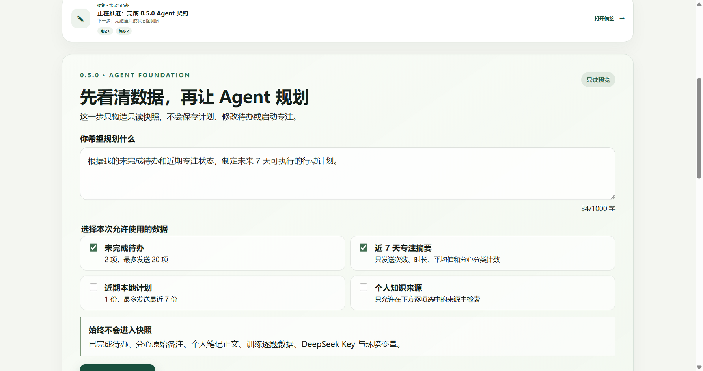
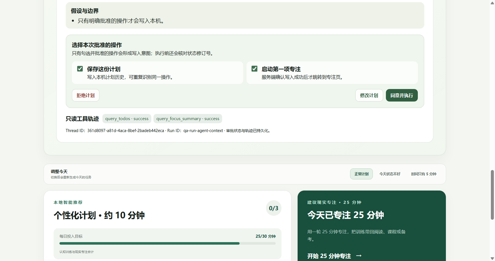

# 息壤项目案例入口

息壤是一款本地优先的 Windows 注意力训练与专注启动应用。项目把 React/Electron 产品界面、本机 FastAPI 服务、本地混合检索、引用式 RAG、可恢复且需人工批准的 LangGraph Agent，以及独立 Evaluation Harness 组合为一条可检查的工程链路。

当前状态：1.1.0 已进入正式发布流程，独立知识工作区、界面字体调节和既有 1.0 桌面能力均纳入统一质量门禁。本页只引用已提交证据，不把固定合成数据集上的结果解释成真实用户效果。

## 10 分钟导览

1. 用 2 分钟看[运行时架构与数据边界](architecture.md)，先理解什么留在设备、什么会出站、谁拥有写权限。
2. 用 3 分钟看下方两张产品截图：最小数据快照与人工审批是同一条 Agent 边界。
3. 用 3 分钟看[关键技术决策与失败案例](decisions-and-failures.md)，重点关注恢复、幂等、故障关闭和桌面生命周期。
4. 用 2 分钟看[指标证据索引](evidence-map.md)，每个数字都能回到冻结报告。

若要实际运行，请直接进入[招聘方复现指南](reproduce.md)。若要面试演示，请使用[5 至 8 分钟演示脚本](demo-script.md)。

若需要一页内快速转发，可直接查看[项目案例一页纸 PDF](../../output/pdf/xirang-0.8.0-project-one-pager.pdf)；其内容源与验收契约位于 [`one-pager/`](one-pager/)。

## 项目要解决的问题

常见的效率工具要么只记录任务，要么把个人数据直接交给云端模型。息壤尝试把“记录任务、缩小第一步、短训练、现实专注、个人趋势、知识检索、AI 周计划”放在同一条本地优先路径中，同时维持三条硬边界：

- 用户在发送前能看到最小快照，并逐类授权待办、近期计划、专注摘要和知识来源。
- Agent 在审批前只读；批准后也只返回带状态修订号和确定性 `actionId` 的写入意图，由前端原子校验和执行。
- 评测、性能和安全结果都绑定固定数据集、版本与报告，不把离线分数包装成真实用户收益。

## 代表性产品路径

### 发送前先看清数据

快照明确列出本次授权的数据类别，也明确排除分心原始备注、个人笔记正文、逐题训练数据、环境变量和 DeepSeek Key。实现入口见 [`agentContext.ts`](../../src/lib/agentContext.ts) 与 [`AgentContextPreview.tsx`](../../src/components/AgentContextPreview.tsx)。

### 写入前必须人工批准

同意、修改和拒绝都经过持久化状态；只有批准的操作才会生成 `save_plan` / `start_focus` Mutation Intent。状态变化或断线重试不会静默重复写入，详见[架构说明](architecture.md#人工审批与写入边界)。

## 可核验结果

| 主题 | 冻结结果 | 证据边界 |
| --- | --- | --- |
| Agent Fake Eval | 15/15；审批绕过、批准前写入、未授权工具、重复副作用、敏感泄露均为 0 | 合成快照与脚本规划器，只证明确定性工程回归 |
| Agent DeepSeek 保留集 | 5/5；P50/P95 15.842/16.815 秒；估算成本上界约 $0.00505 | 5 条脱敏合成快照，不代表开放域质量 |
| 混合检索保留集 | 80 条保留查询；RRF + Cross-Encoder Recall@5 0.7933、MRR@5 0.5891 | 15 份项目文档、100 条人工标注查询，本机 CPU |
| 引用式生成 | 12/12；结构、拒答、引用、忠实度代理、注入抵抗均为 100% | 小型人工合成集，不等于通用事实核查 |
| 0.7.0 自动化 | 前端 55、Electron 8、API 66 个用例全部通过；远端 Windows CI 通过 | 2026-09-15 冻结环境 |
| 本机性能 | Agent SSE 首事件 P95 29.109 ms；BGE 热查询 P95 12.604 ms；热重排 P95 81.608 ms | 同类 CPU 环境回归，不代表所有设备 |

数字的原始报告、数据集与解释限制统一维护在[指标证据索引](evidence-map.md)。

## 30 分钟代码审阅路径

1. Agent 状态图：[`server/agent/graph.py`](../../server/agent/graph.py)
2. 契约与写入意图：[`server/agent/contracts.py`](../../server/agent/contracts.py)
3. 前端修订冲突与幂等执行：[`src/lib/agentMutations.ts`](../../src/lib/agentMutations.ts)
4. SQLite Checkpoint 与 Trace：[`server/agent/checkpoints.py`](../../server/agent/checkpoints.py)、[`server/agent/tracing.py`](../../server/agent/tracing.py)
5. 本地混合检索与索引恢复：[`server/hybrid.py`](../../server/hybrid.py)、[`server/semantic.py`](../../server/semantic.py)
6. Electron sidecar 生命周期：[`electron/api-service.cjs`](../../electron/api-service.cjs)、[`electron/runtime-paths.cjs`](../../electron/runtime-paths.cjs)
7. 独立 Agent Eval：[`server/evals/agent/`](../../server/evals/agent/)
8. Windows CI：[`quality-gate.yml`](../../.github/workflows/quality-gate.yml)

## 复现与展示材料

- [复现指南](reproduce.md)：从安装依赖到 Fake Eval、完整门禁和可选本地模型。
- [合成演示数据](demo-data/README.md)：可导入 v11 备份与可授权知识文档。
- [演示脚本](demo-script.md)：现场演示、录屏和无付费 Key 降级方案。
- [架构与数据边界](architecture.md)：运行时、存储、出站和写入所有权。
- [技术决策与失败案例](decisions-and-failures.md)：为什么这样设计，以及哪些问题迫使设计改变。
- [简历项目描述](resume-copy.md)：不同篇幅的事实型表述，待本人按真实职责选择。
- [项目案例一页纸](../../output/pdf/xirang-0.8.0-project-one-pager.pdf)：A4 单页 PDF，数字来自同一证据索引，已完成逐页视觉检查。
- [全新数据空间导入验收](../../artifacts/evals/0.8.0-portfolio-acceptance.md)：记录合成备份、知识文档、授权与隐私检查结果。

## 明确不宣称

- 不宣称产品能诊断或治疗 ADHD，也不把任务分数解释为医学结论、人群百分位或“脑年龄”。
- 不宣称 Agent 已在真实用户流量中证明质量、留存或行动效果。
- 不宣称所有数据都永不出站；只有显式触发 DeepSeek 生成时，预览过的最小快照或证据才会发送。
- 不把当前开发机上的安装与性能结果外推为所有 Windows 设备上的表现。
- 仓库仅展示源码、测试和工程证据，不提供预编译安装包；历史打包结果仅用于本地桌面能力验收。
