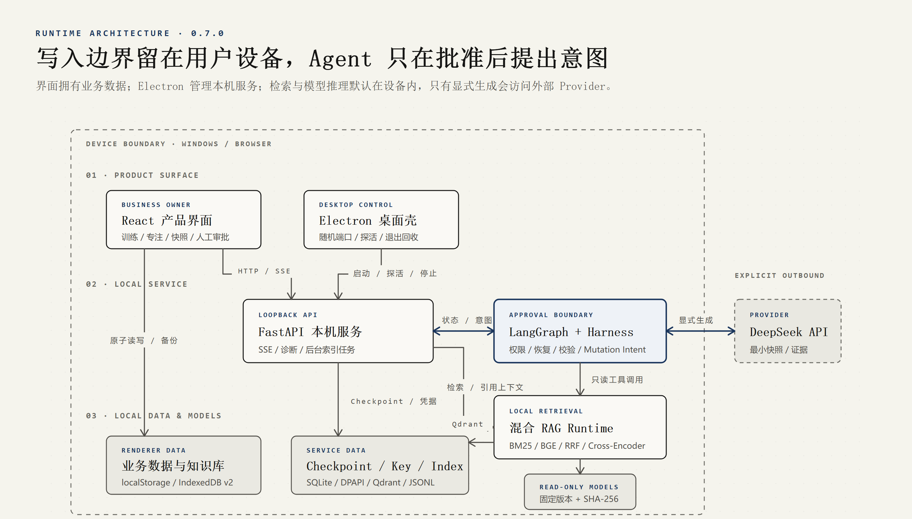

# 运行时架构与数据边界

这张图描述已经随 0.7.0 交付的运行时，而不是 0.8.0 的材料制作流程。阅读顺序从界面到本机服务，再到存储；唯一的设备外节点是显式调用的 DeepSeek API。

图源为自包含的 [`index.html`](diagrams/runtime-architecture/index.html)，重绘意图记录在 [`prompt.md`](diagrams/runtime-architecture/prompt.md)。修改图源后运行 `npm run portfolio:render-diagrams`，再用 `npm run portfolio:check` 验证 PNG 与图源哈希一致。

## 组件职责

| 层 | 组件 | 责任与边界 |
| --- | --- | --- |
| 产品界面 | React + Vite | 训练、专注、笔记、知识库、Agent 快照预览与人工审批；持有业务状态 |
| 桌面壳 | Electron | 分配随机回环端口，启动、探活、监控和关闭 FastAPI sidecar；preload 不暴露通用 Node 能力 |
| 本机 API | FastAPI | 检索、RAG、Agent、Checkpoint、诊断与后台索引任务；只监听 `127.0.0.1` |
| Agent Runtime | LangGraph + 自研 Harness | 状态图、工具权限、结构校验、Interrupt/Resume、Trace、Mutation Intent 和 Eval 接口 |
| RAG Runtime | BM25 + BGE + RRF + Cross-Encoder | 本机检索、融合、重排、引用上下文和提示注入标记 |
| 云端 Provider | DeepSeek | 仅在用户主动生成时接收预览过的最小快照或证据；默认复现路径不需要它 |

## 数据驻留矩阵

| 数据 | 默认位置 | 是否进入完整备份 | 是否可能出站 |
| --- | --- | --- | --- |
| 训练、现实专注、待办、笔记、计划与设置 | Renderer `localStorage` | 是 | 只有被用户选入最小快照的结构化子集可能出站 |
| 知识正文、授权、文本块与检索记录 | Renderer IndexedDB v2 | 是 | 只有用户选择的来源经过检索后，最小证据可能出站 |
| DeepSeek Key | Windows 当前用户 DPAPI 密文 | 否 | 明文只由本机后端用于 Provider 鉴权，不回传浏览器 |
| Agent Checkpoint 与脱敏 Trace | 本机 SQLite | 否 | 否；用于同一设备恢复与诊断 |
| Qdrant 向量索引与索引元数据 | 本机服务数据目录 | 否，可重建 | 否 |
| BGE 与 Cross-Encoder 模型 | 安装资源或固定模型目录，只读 | 否 | 模型下载阶段需要网络；推理在本机 CPU 完成 |
| sidecar 结构化日志 | 本机日志目录 | 否 | 否；不得记录 Key 与用户正文 |

浏览器版与 Electron 桌面版使用不同的 Renderer 数据空间，历史记录不会自动同步。完整 JSON 备份用于显式迁移业务数据和知识库；凭据、向量索引、Checkpoint 和待审批线程被有意排除。

## 人工审批与写入边界

1. React 根据用户勾选的类别构造 `ActionContextSnapshot`，同时计算 `baseStateRevision`；发送前可见且可取消。
2. LangGraph 只调用三个受权限策略约束的只读工具：待办查询、专注摘要查询、选定知识来源检索。
3. 计划草案通过结构、待办 ID、引用白名单和权限校验后，在 SQLite Checkpoint 进入 `awaiting_approval`。
4. 用户可拒绝、修改或同意。拒绝直接结束；修改后重新校验；同意后才生成确定性的 `save_plan` / `start_focus` Mutation Intent。
5. 前端在一个原子批次内核对状态修订号、Intent 契约和 `actionId`。冲突会失败关闭；已执行 ID 会返回 `already_applied`，不会重复副作用。
6. 前端把执行确认回传后，图才进入 `completed`。在确认前关闭页面或重启服务，可以凭稳定 Thread ID 继续。

对应实现与回归测试：

- 状态图与节点：[`graph.py`](../../server/agent/graph.py)、[`nodes.py`](../../server/agent/nodes.py)
- 契约与权限：[`contracts.py`](../../server/agent/contracts.py)、[`policies.py`](../../server/agent/policies.py)
- 前端执行：[`agentMutations.ts`](../../src/lib/agentMutations.ts)
- 服务重启、三种审批、冲突与幂等测试：[`test_agent_stateful.py`](../../server/tests/test_agent_stateful.py)

## 故障关闭策略

- 未知未来图版本的 Checkpoint 不尝试猜测迁移，返回 `incompatible_checkpoint`。
- 索引提交前写入 `committing`；异常写入 `failed`。这两种状态都不会把旧或半成品索引报告为可用。
- sidecar 的 start/stop/restart 经同一生命周期队列串行化，进程退出与日志关闭都有上限时间。
- 真实 Provider 失败不会降级为伪造的“真实回答”；无 Key 时界面明确提示，Fake Eval 也明确标注为替身。

## 当前限制

- 只实现单设备、thread-scoped 状态，没有跨会话长期记忆、云同步或多用户权限系统。
- Qdrant 使用 local mode，本地模型以 CPU 推理；BGE 冷启动在冻结机器上约 18.47 秒，峰值 RSS 增量约 1000.75 MiB。
- 扫描型 PDF 没有 OCR，复杂多栏 PDF 的顺序取决于文档文字层。
- 0.7.0 的独立干净 Windows 复验、代码签名和自定义图标仍是后续发布门禁。
